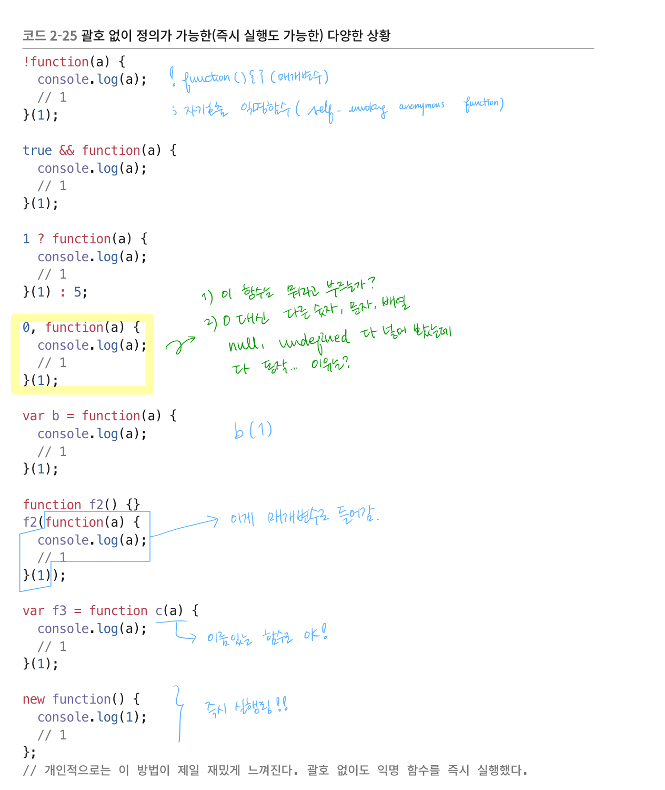

## 2.2 함수 정의 다시 보기

[2.2.1 기본 정의](#2-2-1)<br/>
[2.2.2 호이스팅](#2-2-2)<br/>
[2.2.3 호이스팅 활용하기](#2-2-3)<br/>
[2.2.4 괄호 없이 즉시 실행하기](#2-2-4)<br/>
[2.2.5 new Function이나 eval을 써도 될까요?](#2-2-5)<br/>
[2.2.6 간단 버전 문자열 화살표 함수와 new Function 성능 ](#2-2-6)<br/>
[2.2.7 유명(named) 함수](#2-2-7)<br/>
[2.2.8 유명 함수를 이용한 재귀](#2-2-8)<br/>
[2.2.9 자바스크립트에서 재귀의 아쉬움](#2-2-9)<br/>

<br/>
<br/>
<br/>

<br/>
<br/>
<br/>
<div id="2-2-1">

### 2.2.1 기본 정의

자바스크립트에서 함수를 정의하는 대표적인 방법은 다음과 같다.

```js
// 코드 2-13.일반적인 함수 정의

function add1(a, b) {
  return a + b;
}

var add2 = function (a, b) {
  return a + b;
};

var m = {
  add3: function (a, b) {
    return a + b;
  },
};
```

함수를 정의하는 데 있어서 호이스팅을 확인 해 볼 필요가 있다.

<br/>
<br/>
<br/>
<div id="2-2-2">

### 2.2.2 호이스팅

`호이스팅(hoisting)`이란 변수나 함수가 어디서 선언되든지 해당 스코프 최상단에 위치하게 되ㅓ 동일 스코프 어디서든 참조 할 수 있는 것을 말한다. 

```js
// 코드 2-14. 에러가 나는 상황이지만 호이스팅이다

console.log(add1(10, 5)); // 15
add2(10, 5); // TypeError: add2 is not a function

function add1(a, b) {
  return a + b;
}

var add2 = function (a, b) {
  return a + b;
};
```

`코드 2-14`의 `add1` 과 `add2`에는 호이스팅이 적용된다. 여기서 `add2`가 실행이 안되기 때문에 호이스팅이 아니라고 생각할 수 있겠지만, 그것은 오해다. 물론 add2는 선헌하기 전 라인에서 실행할 수 없다. 하지만 분명히 add2도 호이스팅이 적용된 것이다. 선언은 되었지만 아직 초기화되지 않은 상태에서 실행했기 때문에 에러가 난 것이다.

여기서 우리가 짚고 넘어가야 할 중요한 키워드가 두 개 있다. 👉🏼 `선언`, `참조`

예제에서 `add2`는 실행되지 않았고, `add2 is not a function` 이라는 에러 메세지가 출력되었다. 그렇다면 선언 한 적이 없는 함수를 실행하면 어떻게 될까?

```js
// 코드 2-15. 선언한 적 없는 함수 실행

hi(); // hi is not defined
```

선언한 적이 없는 함수를 실행하면 에러 메세지(`hi is not defined`)가 다르다. 자바스크립트에서는 아예 선언된 적이 없는 것을 참조하려고 할 때 이런 에러가 난다. 실행하지 않고 참조만 하려고 해도 동일한 에러가 난다.

```js
// 코드 2-16. 선언한 적 없는 변수 참조하기

var a = hi; // ReferenceError: hi is not defined
```

이 에러 메세지는 코드 2-14의 add2를 실행했을 때 출력된 메세지 `add2 is not a function`과는 다르다. 코드 2-14에서의 에러는 호이스팅에 의해 참조는 가능하지만 아직 function은 아니라는 에러고, 코드 2-15와 코드 2-16의 에러는 선언되지 않았다는 에러다. 

- 코드 2-14: `add is not a function` - "참조는 가능한데 아직 함수는 아니야"
- 코드 2-15 & 코드 2-16: `hi is not defined` - "아직 선언이 안됐는데?"


```js
// 코드 2-17. 실행하지 않고 참조만 해보기

console.log(add1); // [Function: add1]
console.log(add2); // undefined

function add1(a, b) {
  return a + b;
}
var add2 = function (a, b) {
  return a + b;
};
```

이번에 `add2`는 에러가 나지 않았고 `undefined`가 출력되었다. 그렇다면 왜 add1 은 실행이 되고 add2 는 실행이 안되는 걸까?

이는 **변수 선언과 함수 선언에서의 차이** 때문이다. 변수는 선언 단계와 초기화 단계가 구분되어 있다. 변수는 선언과 초기화가 동시에 이루어지지 않기 때문에 호이스팅에 의해 참조만 가능하고, 아직 값이 담기지 않아 실행은 불가능하다. 반면에 함수 선언은 선언과 동시에 초기화가 이루어지기 때무에 참조 뿐 아니라 실행도 가능하다.

- 변수: 선언과 초기화가 동시에 이루어지지 않음 👉🏼 선언 X 참조 O
- 함수: 선언과 동시에 초기화가 이루어짐 👉🏼 선언 O 참조 O

호이스팅에 의해 add1은 미리 실행할 수 있고, add2는 호이스팅에 의해 미리 참조할 수 있지만 값이 없어 실행할 수는 없다.

<br/>
<br/>
<br/>
<div id="2-2-3">

### 2.2.3 호이스팅 활용하기

```js
// 코드 2-18. 호이스팅을 이용하여 return 문 아래애 함수 선언하기

function add(a, b) {
  return valid() ? a + b : new Error();
  function valid() {
    return Number.isInteger(a) && Number.isInteger(b);
  }
}

console.log(add(10, 5)); // 15
console.log(add(10, "a")); // Error(...)
```

위와 같이 return 문 아래에 정의한 함수도 실행이 가능하다. 코드 2-18과 같은 스타일의 코드는 어떤 곳에서는 추천하지 않기도 하지만, 이런 기법이 유용할 때가 있다. 

```js
// 코드 2-19. 호이스팅을 이용해 코드의 순서를 이해하기 편하게 배치

// [1] end 가 먼저 정의되어 코드가 다소 복잡하게 읽힌다.
app.post("/login", function (req, res) {  
  db.select( "users", { where: { email: req.body.email } }, function (err, user) {
      function end(user) {
        req.session.user = user;
        res.redirect("/");
      }

      if (user && user.password === req.body.password) return end(user);
      
      db.insert("users", {
          email: req.body.email,
          password: req.body.password,
        }, function (err, user) {
          end(user);
        });
    });
});

// [2] 호이스팅 덕분에 end를 나중에 정의해도 잘 동작한다. 읽기 더 편하다.
app.post("/login", function (req, res) {    // 3
  db.select("users", { where: { email: req.body.email } }, function (err, user) {
      if (user && user.password === req.body.password) return end(user);
      db.insert(
        "users", {
          email: req.body.email,
          password: req.body.password,
        }, function (err, user) {
          end(user);
        });
      function end(user) {
        req.session.user = user;
        res.redirect("/");
      }
    });
});
```

이 코드는 Node.js와 Express.js 등으로 개발하는 상황에서 호이스팅을 이용해 코드의 가독성을 높인 사례다. 여기에서 클로저가 사용되었다고 메모리 누수를 걱정할 필요는 없다. end 에서 res, req를 사용하기 때문에 end는 클로저다. 

<small>
--- 오타에서 막혔엉... 뭘까..뭐였을까...
</small>

<br/>
<br/>
<br/>

<div id="2-2-4">

### 2.2.4 괄호 없이 즉시 실행하기

```js
// 코드 2-20. 일반적인 즉시 실행 방식

(function (a) {
  console.log(a);
})(100); // 100
```

자바스크립트에서는 위와 같이 괄호를 통해 익명 함수를 즉시 실행할 수 있다. 괄호 없이 실행하면 어떻게 될까?

```js
// 코드 2-21. 에러가 난 경우

function (a) {
    console.log(a);
  }(100); // SyntaxError: Function statements require a function name
```

에러가 났다! 왜? 익명 함수를 잘못 실행한 것이 아니라 익명 함수 선언 자체가 실패했기 때문이다. 다음 예제를 보면 쉽게 알 수 있다.

```js
// 코드 2-22. 선언만 시도해도 에러가 나는 경우

function() {}
// SyntaxError: Function statements require a function name
```

실행 없이 선언만 시도해도 에러가 난다. 그런데 우리는 이와 비슷한데 에러가 나지 않는 코드를 봤었다.

```js
// 코드 2-23. 괄호 없이 정의했는데 에러가 나지 않는 경우

function f1() {
  return function () {};
}

f1();
console.log(f1()); //[Function (anonymous)]
```

위 코드는 함수를 괄호로 감싸지 않았는데 문법 에러가 나지 않고 정상적으로 동작한다. 이 상황에서 에러가 나지 않는다면 괄호 없이 즉시 실행도 되지 않을까?


```js
// 코드 2-24. 괄화 없이 즉시 실행했는데 에러가 나지 않는 경우

function f1() {
  return (function (a) {
    console.log(a);
  })(1);
}

f1(); // 1
```

f1이라는 함수 안에 있는 익명 함수는 괄호 없이도 즉시 실행되었다. 만일 `f1`이라는 함수의 `return` 바로 뒤에서 함수를 즉시 실행하고 싶다면, 그 상황에서는 괄호 없이도 익명 함수를 즉시 실행할 수 있다. 

```js
// 코드 2-25. 괄호 없이 정의가 가능한(즉시 실행도 가능한) 다양한 상황

// [1]
!(function (a) {
  console.log(a);
})(1);

true &&
  (function (a) {
    console.log(a);
  })(1);

1
  ? (function (a) {
      console.log(a);
    })(1)
  : 5;

0,
  (function (a) {
    console.log(a);
  })(1);

var b = (function (a) {
  console.log(a);
})(1);

function f2() {}
f2(
  (function (a) {
    console.log(a);
  })(1)
);

var f3 = (function c(a) {
  console.log(1);
})(1);  

new (function () {
  console.log(1);
})();
```

**👩🏻‍🏫 여기서 잠깐!**

코드 2-25의 [1]을 보면 다음과 같다.

```js
!(function (a) {
  console.log(a);
})(1);
```
`!function(){}()`의 형식으로 쓸 경우 `자기호출 익명함수(Self-invoking anonymous function` 이라는 것을 알게 되었다. 말 그대로 자기 스스로를 호출한다. 그리고 뒤의 `()`를 통해 함수에 이용될 매개 변수를 받는다. 

느낌표를 사용하면 Boolean 값을 호출하며 반환되는 리턴값의 반대값을 호출한다. (반환되는 값이 true 면 false로, false면 true로)

```js
console.log(!(function () {})()); // true
console.log((function () {})()); // undefined : falsy value
```



위와 같은 상황에서의 공통점은 무엇일까? 일단 **모두 연산자와 함께 있고, 함수가 값으로 다뤄졌다.** 그리고 모두 익명 함수 선언에 대한 오류가 나지 않는다. 앞에서 즉시 실행이 실패했던 이유는 익명 함수를 잘못 실행한 것이 아니라 익명 함수 선언 자체를 하지 못해서였다. 익명 함수 뿐 아니라 유명(named) 함수도 즉시 실행할 수 있다.

함수를 정의할 수 있는 곳이라면 그곳이 어디든 실행도 할 수 있다. 코드를 실행할 수 있는 모든 곳에서 모든 종류의 함수를 선언할 수는 없지만, 함수를 선언할 수 있는 모든 영역에서는 익명 함수든, 유명 함수든, 일반 함수든, 메서드든 모두 실행할 수 있다. 연산자의 피연산자가 되면, 혹은 return 등과 함께 사용되면, 익명 함수를 선언할 수 있게 되고 익명 함수를 선언할 수 있으면 즉시 실행도 할 수 있다.

다음과 같이 하면 함수형 프로그래밍과는 무관하지만 객체도 하나 만들 수 있다.

```js
// 코드 2-26.

var pj = new (function () {
  this.name = "PJ";
  this.age = 28;
  this.constructor.prototype.hi = function () {
    console.log("hi");
  };
})();

console.log(pj); // { name: 'PJ', age: 28 }
pj.hi(); // hi
```

값으로 함수를 잘 다룰 수 있다면 즉시 실행도 자유롭게 잘 다룰 수 있다는 얘기를 하고 싶다.

```js
// 코드 2-27. 즉시 실행하며 this 할당하기

var a = function (a) {
  console.log(this, a);
}.call([1], 1); // [ 1 ] 1
```

함수의 메서드인 `call` 을 `.`으로 접근할 수 있으며 익명 함수를 즉시 실행하면서 this를 할당할 수도 있다. 즉시 실행 기법은 최상위 스코프에서만 사용하는 것이 아니다. 모듈 간의 혼선을 보호하거나 은닉 하기 위해서만 사용하는 것도 아니다. `(f())`, `(f)()`만 써야하는 것도 아니다. 특정 상황에 꼭 맞는 문법을 선택하면 된다.

<br/>
<br/>
<br/>
<div id="2-2-5">

### 2.2.5 new Function이나 eval을 써도 될까요?

함수를 정의하는 방법 중에는 `new Function`을 활용하는 방법이 있다. `new Function`이나 `eval`같은 기법은 보안 문제가 있어 사용하지 말라는 이야기가 있다. 하지만 서버에서 클라이언트가 보낸 값을 이용해 `new Function`이나 `eval`을 하는 것이 아니라면 사실상 보안 문제라는 것은 있을 수 없다. 만약 `new Function`이나 `eval`을 클라이언트에서만 동작하는 코드에서 사용한다면 어떤 보안 문제도 있을 수 없다.

서버에서도 마찬가지로 서버에서 생성한 값 만으로 `new Function`이나 `eval`을 한다면 보안상 문제가 생기지 않는다. 어디까지나 보안에 대한 과제는 클라이언트의 특정 요청에 대해 서버에서 응답을 줘도 될 것인지 안 될것인지 잘 판단하는 데 달려있다. 

`new Function`과 `eval`을 성능상의 이유로 사용하지 말라고 하지만, 성능 저하의 직접적인 원인이 되지 않도록 사용하면 성능 문제는 최소화 된다.

특정 기법이 느리다고 할지라도 개발 생산성이나 로직에 있어서 매우 안정적이고 효율적이라면 다른 부분을 보완하는 것으로 해결할 수 있을지 검토해 볼 필요가 있다. `new Function`도 그렇다. 자바스크립트로 HTML 템플릿 엔진을 만든다거나, 기타 특정 상황에서는 `new Function`이 꼭 필요할 때가 있다.

```js
// 코드 2-28

var a = eval("10 + 5");
console.log(a);

var add = new Function("a,b", "return a+b;");
add(10, 5); // 15
```

<br/>
<br/>
<br/>
<div id="2-2-6">

### 2.2.6 간단 버전 문자열 화살표 함수와 new Function 성능 

화살표 함수는 ES6에서 사용할 수 있다.

```js
// 코드 2-29. 간단 버전 문자열 화살표 함수

function L(str) {
  var splitted = str.split("=>");
  return new Function(splitted[0], "return (" + splitted[1] + ");");
}

L("n => n * 10")(10); // 100
L("n => n * 10")(20); // 200
L("n => n * 10")(30); // 300
L("a, b => a + b")(10, 20); // 30
L("a, b => a + b")(10, 5); // 15
```

구현은 간단하다. 문자열에서 `=>` 를 기준으로 나눠 앞부분을 `new Function`의 첫번째 인자에 넣었다. `new Function`의 첫번째 인자는 함수의 인자 선언부에 사용 될 코드가 된다. `splitted[1]`는 함수의 몸통 부분으로 사용된다. L을 사용하면 간단한 한 줄짜리 코드를 화살표 함수처럼 작성할 수 있다.

성능상의 차이는 어느정도 일까? 다음 코드는 일반적인 익명 함수 선언과 `new Function`의 성능 차이를 보여 준다.

```js
// 코드 2-30. 10,000번 선언해 보기

console.time("익명함수");
for (var i = 0; i < 10000; i++) {
  (function (v) {
    return v;
  })(i);
}
console.timeEnd("익명함수");

console.time("new Function");
for (var i = 0; i < 10000; i++) {
  L("v=>v")(i);
}
console.timeEnd("new Function");

// 익명함수: 0.557ms
// new Function: 10.573ms
```

둘 다 동일한 일을 하지만 함수를 선언하는데 소요된 시간의 차이가 꽤 크다. 

이번에는 `_.map`을 이용해 length가 10,000인 배열을 돌면서 i를 곱해 [0,2,4,6,...] 의 새로운 배열 객체를 만드는 코드로 성능을 비교해 보자.

```js
// 코드 2-31. 익명 함수와 문자열 화살표 함수


```


<br/>
<br/>
<br/>
<div id="2-2-7">

### 2.2.7 유명(named) 함수
<br/>
<br/>
<br/>
<div id="2-2-8">

### 2.2.8 유명 함수를 이용한 재귀
<br/>
<br/>
<br/>
<div id="2-2-9">

### 2.2.9 자바스크립트에서 재귀의 아쉬움


