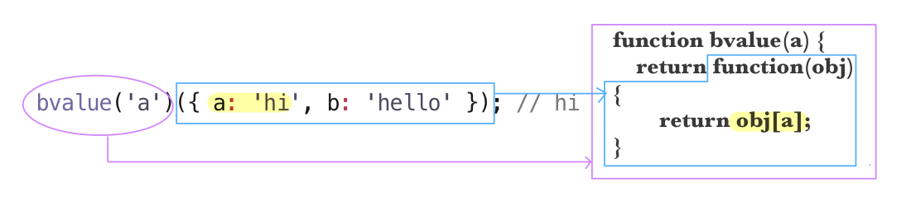

# 1장. 함수형 자바스크립트 소개

> 절차지향적으로 작성된 코드를 함수형으로 리팩터링하면서 함수형 자바스크립트의 실용성을 확인한다. 실무에서 사용할 만한 데이터와 코드에서 map, filter, find 등 고차 함수의 로직을 발견한다. 클로저에 대해서는 함수형 자바스크립트적인 관점으로 다시 접근하여 설명한다.

<br/>

좋은 프로그램이란 **사용성, 성능, 확장성, 기획 변경에 대한 대응력** 등을 척도로 삼아 이것들을 효율적, 생산적으로 이뤄낸 프로그램이다. 함수형 프로그래밍은 부수 효과(side effect)를 최대한 멀리하고 조합성을 강조해 성공적인 프로그래밍을 이루도록 함에 그 목적이 있다.

부수 효과를 멀리하는 이유? (1)오류를 줄이기 위해 (2)조합성 혹은 모듈화 수준을 높히기 위해


## 🗂 목차
<details>
<summary>1.1 함수형 프로그래밍 그거 먹는건가요? <a href="#1-1">바로가기</a> </summary> 
<div markdown="1">
&nbsp&nbsp&nbsp&nbsp 1.1.1 함수형 자바스크립트를 검색하면 나오는 예제<br/>
&nbsp&nbsp&nbsp&nbsp 1.1.2 값으로써의 함수와 클로저<br/>
</div>
</details>
<details>
<summary>1.2 함수형 자바스크립트의 실용성 <a href="#1-2">바로가기</a> </summary>
<div markdown="1">
&nbsp&nbsp&nbsp&nbsp 1.2.1 회원 목록 중 여러 명 찾기<br/>
&nbsp&nbsp&nbsp&nbsp 1.2.2 for에서 filter로, if에서 predicate로<br/>
&nbsp&nbsp&nbsp&nbsp 1.2.3 함수형 프로그래밍 관점으로  filter 보기<br/>
&nbsp&nbsp&nbsp&nbsp 1.2.4 map 함수<br/>
&nbsp&nbsp&nbsp&nbsp 1.2.5 실행 결과로 바로 실행하기<br/>
&nbsp&nbsp&nbsp&nbsp 1.2.6 함수를 값으로 다룬 예제의 필요성<br/>
</div>
</details>
<details>
<summary>1.3 함수형 자바스크립트의 실용성 2 <a href="#1-3">바로가기</a></summary>
<div markdown="1">
&nbsp&nbsp&nbsp&nbsp 1.3.1 회원 목록 중 한 명 찾기<br/>
&nbsp&nbsp&nbsp&nbsp 1.3.2 값에서 함수로<br/>
&nbsp&nbsp&nbsp&nbsp 1.3.3 함수를 만드는 함수와 find, filter 조합하기<br/>
&nbsp&nbsp&nbsp&nbsp 1.3.4 고차 함수<br/>
&nbsp&nbsp&nbsp&nbsp 1.3.5 function identity(v) {return v;}, 이건 어디다 쓰는거지?<br/>
&nbsp&nbsp&nbsp&nbsp 1.3.6 연산자 대신 함수로<br/>
&nbsp&nbsp&nbsp&nbsp 1.3.7 함수 합성<br/>
</div>
</details>
<details>
<summary>1.4 함수형 자바스크립트를 위한 기초</summary>
<div markdown="1">
&nbsp&nbsp&nbsp&nbsp 1.4.1 일급 함수<br/>
&nbsp&nbsp&nbsp&nbsp 1.4.2 클로저<br/>
&nbsp&nbsp&nbsp&nbsp 1.4.3 클로저의 실용 사례<br/>
&nbsp&nbsp&nbsp&nbsp 1.4.4 클로저를 많이 사용하라!<br/>
&nbsp&nbsp&nbsp&nbsp 1.4.5 고차 함수<br/>
&nbsp&nbsp&nbsp&nbsp 1.4.6 콜백 함수라 잘못 불리는 보조 함수<br/>
&nbsp&nbsp&nbsp&nbsp 1.4.7 함수를 리턴하는 함수와 부분 적용<br/>
</div>
</details>
<details>
<summary>1.5 정리</summary>
<div markdown="1">
</div>
</details>

## 📝 용어 정리
<details>
<summary>커링(Currying)</summary>
<div markdown="2">
&nbsp&nbsp&nbsp&nbsp 인자를 여러개 받는 함수를 분리하여, 인자를 하나씩만 받는 함수의 체인으로 만드는 방법. 함수형 프로그래밍의 기법 중 하나로 함수를 재사용하는데 유용하게 쓰일 수 있는 기법이다. 자바스크립트 내부에는 커링이 내장되어 있지 않지만 자바스크립트로도 구현이 가능하다.
</div>
</details>
<details>
<summary>부분 적용(Partial Application)</summary>
<div markdown="2">
&nbsp&nbsp&nbsp&nbsp 그 함수를 처리할 수 있는 파라미터의 범위가 부분적이다. 파라미터 값의 일부 범위만 처리할 수 있다.
</div>
</details>
<details>
<summary>클로저(Clojure)</summary>
<div markdown="2">
&nbsp&nbsp&nbsp&nbsp 내부함수가 외부함수의 지역변수에 접근 할 수 있고, 외부함수는 외부함수의 지역변수를 사용하는 내부함수가 소멸될 때까지 소멸되지 않는 특성을 의미한다. 내부함수는 외부함수의 지역변수에 접근 할 수 있는데 외부함수의 실행이 끝나서 외부함수가 소멸된 이후에도 내부함수가 외부함수의 변수에 접근 할 수 있다. 
</div>
</details>


---
<div id="1-1"></div>

### 1.1 함수형 그거 먹는 건가요?


[1.1.1 함수형 자바스크립트를 검색하면 나오는 예제](#1-1-1)<br/>
[1.1.2 값으로써의 함수와 클로저](#1-1-2)<br/>

<div id="1-1-1"></div>

#### 1.1.1 함수형 자바스크립트를 검색하면 나오는 예제

```javascript
// 코드 1-1. addMaker

// 커링의 대표적인 예시
function addMaker(a) {
  return function (b) {
    return a + b;
  };
}
addMaker(10)(5); // 15
```

```javascript
// 코드 1-2. addMaker로 만든 함수

var add5 = addMaker(5);
add5(3); // 8
add5(4); // 9
```

위의 코드를 통해 값으로서의 함수, 클로저, 스코프 등 많은 이야기를 풀어낼 수 있다.

```javascript
// 코드 1-3 값으로서의 함수

var v1 = 100;
var v2 = function () {}; // 변수에 함수를 담고 있다
function f1() { return 100; }
function f2() { return function () {};} // f2 함수가 또 다른 함수를 리턴한다

```

<div id="1-1-2"></div>

#### 1.1.2 값으로써의 함수와 클로저


함수는 값을 리턴할 수 있고 함수는 값이 될 수 있다.

```javascript
// 코드 1-4. addMaker 다시보기

function addMaker(a) {
  return function (b) {
    return a + b;
  };
}

var add5 = addMaker(5); //15
add5(3); // 8
add5(4); // 9

var add3 = addMaker(3);
add3(3); // 6
add3(4); // 7
```


여기서 addMaker가 리턴한 익명 함수는 클로저가 되었다.

**클로저의 특징**: 리턴된 익명 함수 내부에서 a 를 정의한 적은 없지만 부모 스코프에 있는 a를 참조하고 있다.  (위에서는 a 값이 불변하며 상수로 쓰이지만 클로저가 기억하는 변수의 값은 변할 수 있음에 주의하자. → 1.4절 참고)
<br/>

<div id="1-2"></div>

### 1.2 함수형 자바스크립트의 실용성

절차지향적으로 작성된 코드를 함수형으로 변경하며 함수형 자바스크립트의 실용성을 알아보자.

[1.2.1 회원 목록 중 여러 명 찾기](#1-2-1)<br/>
[1.2.2 for에서 filer로, if에서 predicate로](#1-2-2)<br/>
[1.2.3 함수형 프로그래밍 관점으로 filter 보기](#1-2-3)<br/>
[1.2.4 map 함수](#1-2-4)<br/>
[1.2.5 실행 결과로 바로 실행하기](#1-2-5)<br/>
[코드 1-12와 코드 1-5 비교 해보기 (함수형 vs 반복문)](#comparison-1)<br/>
[1.2.6 함수를 다른 값으로 다룬 예제의 실용성](#1-2-6)<br/>

<br/>


<div id="1-2-1"></div>

#### 1.2.1 회원 목록 중 여러 명 찾기

```javascript
// 코드 1-5. for 문으로 필터링하기

var users = [
  { id: 1, name: "ID", age: 32 },
  { id: 2, name: "HA", age: 25 },
  { id: 3, name: "BJ", age: 32 },
  { id: 4, name: "PJ", age: 28 },
  { id: 5, name: "JE", age: 27 },
  { id: 6, name: "JM", age: 32 },
  { id: 7, name: "HI", age: 24 },
];

// (1) user 중 나이 30 미만을 모아서 emp_users에 담아 출력한다
var temp_users = [];
for (var i = 0, len = users.length; i < len; i++) {
  if (users[i].age < 30) temp_users.push(users[i]);
}
console.log(temp_users.length); // 4

// (2) 그들의 나이만 다시 모아 출력한다
var ages = [];
for (var i = 0, len = temp_users.length; i < len; i++) {
  ages.push(temp_users[i].age);
}
console.log(ages); // [25,28,27,24]

// (3) 나이 30 이상을 모아서 temp_users에 담아 출력한다
var temp_users = [];
for (var i = 0, len = users.length; i < len; i++) {
  if (users[i].age >= 30) temp_users.push(users[i]);
}
console.log(temp_users.length); // 3

// (4) 그들의 이름만 다시 모아 출력한다
var names = [];
for (var i = 0, len = temp_users.length; i < len; i++) {
  names.push(temp_users[i].name);
}
console.log(names); // ['ID','BJ','JM']

```
(1)과 (3)의 for 문에서 조건(`age >= 30, age < 30`)을 제외하고는 모두 동일한 코드를 가지고 있다. 이런 중복을 제거하기 위해 함수를 활용하면 쉽게 추상화가 가능하다.

<div id="1-2-2"></div>

#### 1.2.2 for에서 filer로, if에서 predicate로

```javascript
// 코드 1-6. filter

// 기존 코드
/*
var temp_users = [];
for (var i = 0, len = users.length; i < len; i++) {
  if (users[i].age < 30) temp_users.push(users[i]);
}
console.log(temp_users.length); // 4
*/

// 바꾼 코드
function filter(list, predicate) {
  var new_list = [];
  for (var i = 0, len = list.length; i < len; i++) {
    if (predicate(list[i])) new_list.push(list[i]);
  }
  return new_list;
}
```

filter 함수는 인자로 `list`와 `predicate 함수`를 받는다. 루프를 돌며 list의 i 번째의 값을 predicate에게 넘겨준다. predicate 함수는 list.length 만큼 실행되며, predicate 함수의 결과가 참일 때만 new_list.push 를 실행한다. **new_list.push가 실행될지 여부를 predicate 함수에게 완전히 위임한 것**이다. filter 함수는 predicate 함수 내부에서 어떤 일을 하는지(어떤 조건을 만드는지) 모르고, 오직 predicate 의 결과에만 의존한다.

마지막에 new_list 를 리턴하는데 여기서 `new_` 는 함수형 프로그래밍에서 상징적인 부분이다. 이전 값의 상태를 변경하지 않고(조건에 맞지 않는 값을 지우거나 하지 않고) 새로운 값을 만드는 식으로 값을 다루는 것은 함수형 프로그래밍의 매우 중요한 콘셉트 중 하나다.

```javascript
// 코드 1-7. filter 사용

// (1)
                                    //predicate
var users_under_30 = filter(users, function (user) {
  return user.age < 30;
});
console.log(users_under_30.length); // 4

var ages = [];
for (var i = 0, len = users_under_30.length; i < len; i++) {
  ages.push(users_under_30[i].age);
}
console.log(ages); // [25,28,27,24]

// (2)
var users_over_30 = filter(users, function (user) {
  return user.age >= 30;
});
console.log(users_over_30.length); // 3

var names = [];
for (var i = 0, len = users_over_30.length; i < len; i++) {
  names.push(users_over_30[i].name);
}
console.log(names); // [ 'ID', 'BJ', 'JM' ]
```

(1), (2)에서 filter 함수를 실행하며 predicate 자리에 익명 함수를 정의해 넘겼다. 여기서 익명함수는 true/false 를 리턴하며, filter 함수는 익명함수가 true 를 넘겨줄 때만 new_list에 user를 담아 리턴한다.(코드 1-6, 코드 1-7)

<div id="1-2-3"></div>

#### 1.2.3 함수형 프로그래밍 관점으로 filter 보기

`filter` 함수는 **항상 동일하게 동작하는 함수**다. 한가지 로직을 가졌다는 얘기다. filter 함수의 로직은 외부나 내부의 어떤 상태 변화에도 의존하지 않는다. 또한, new_list는 이 함수에서 최초로 만들어졌고, new_list가 완성될 때 까지는 외부에서 어떠한 접근도 할 수 없기 때문에 filter의 결과도 달라질 수 없다. new_list 가 완성되고 나면 new_list를 리턴해버리고 filter는 <u>완전히 종료</u> 된다. new_list가 외부로 전달되고 나면 new_list와 filter와의 연관성도 없어진다.

```javascript
// 코드 1-6. filter

function filter(list, predicate) {
    var new_list = [];
    for(var i=0, len=list.length; i<len;i++>) {
        if(predicate(list[i])) new_list.push(list[i]);
    }
    return new_list;
}
```

filter의 if는 predicate 결과에만 의존한다. 코드 1-7에서 filter를 사용하는 부분에는 for 도 없고 if 도 없기 때문에 별도의 로직이라고 할 만한 것이 없으며 매우 단순하고 쉽다. predicate 에서도 역시 변경되는 값이 없으며 true/false 를 if 에게 전달하는 일만 한다.

```javascript
// 코드 1-7의 일부분을 떼어왔다

filter(users, function (user) { return user.age < 30 });
```
- 절차지향 프로그래밍: 위에서 아래로 내려가며 특정 변수의 값을 변경해 나가는 식으로 로직을 만든다.
- 객체지향 프로그래밍: 객체들을 만들어놓고 객체들 간의 협업을 통해 로직을 만든다. 이벤트 등으로 서로 연결한 후 상태 변화를 감지해 자신의 랎을 변경하거나 상대의 메서드를 직접 실행해 상태를 변경하는 식이다.
- 함수형 프로그래밍: **항상 동일하게 동작하는 함수** 를 만들고 보조 함수를 조합하는 식을 로직을 완성한다. 내부에서 관리하고 있는 상태를 따로 두지 않고 넘겨진 인자에만 의존한다. 동일한 인자가 들어오면 항상 동일한 값을 리턴한다. 보조 함수 역시 인자이며, 보조함수에서도 상태를 변경하지 않으면 보조 함수를 받은 함수는 항상 동일한 결과를 만드는 함수가 된다.

> 현대 프로그래밍에서 다루는 값은 대부분 객체이므로 함수형 프로그래밍에서도 결국 객체를 다뤄야 한다. 다만 기능 확장을 객체의 확장으로 풀어가느냐 함수 확장으로 풀어가느냐의 차이다. 객체를 확장하느냐 객체를 다루는 함수를 늘리느냐의 차이이며 추상화의 단위가 클래스냐, 함수냐의 차이다.

#### 1.2.4 map 함수
리팩터링의 핵심은 중복을 제거하고 의도를 드러내는 것이다.

```javascript
// 코드 1-8. map

// 기존 코드(코드 1-7.)
/*
var ages = [];
for (var i = 0, len = users_under_30.length; i < len; i++) {
  ages.push(users_under_30[i].age);
}
console.log(ages); // [25,28,27,24]

var names = [];
for (var i = 0, len = users_over_30.length; i < len; i++) {
  names.push(users_over_30[i].name);
}
console.log(names); // [ 'ID', 'BJ', 'JM' ]
*/

// 바꾼 코드
function map(list, iteratee) {
  var new_list = [];
  for (var i = 0, len = list.length; i < len; i++) {
    new_list.push(iteratee(list[i]));
    // new_list에 무엇을 push 할 지 iteratee 함수에게 위임했다
  }
  return new_list;
}
```

map  함수를 사용해 보자.

```javascript
// 코드 1-9 map 사용

var users_under_30 = filter(users, function (user) { return user.age < 30; });
console.log(users_under_30.length); //4

var ages = map(users_under_30, function (user) { return user.age; });
console.log(ages); // [25 ,28, 27, 24]

var users_over_30 = filter(users, function (user) { return user.age >= 30; });
console.log(users_over_30.length); // 3

var names = map(users_over_30, function (user) { return user.name;});
console.log(names); // ["ID", "BJ", "JM"]

```

- 회원 중 나이가 30세 미만인 사람들을 뽑아 users_under_30에 담는다.
- users_under_30에 담긴 회원의 나이만 뽑아서 출력한다.
- 회원 중 나이가 30세 이상인 사람들을 뽑아 users_over_30에 담는다.
- users_over_30에 담긴 회원의 이름만 뽑아서 출력한다.

for도 없고, if도 없다. 코드가 매우 단순해졌으며, 코드를 해석한 내용과 코드의 내용이 거의 일치하고 읽기 쉽다.

<div id="1-2-5"></div>

#### 1.2.5 실행 결과로 바로 실행하기

함수의 리턴값을 바로 다른 함수의 인자로 사용하면 변수 할당을 줄일 수 있다. filter 함수의 결과가 배열이므로 map의 첫 번째 인자로 바로 사용 가능하다.

<span style="color:green">Q. 변수 할당을 줄였을 때 장점이 있나?</span>

```javascript
// 코드 1-10 함수 중첩

var ages = map(
  filter(users, function (user) { return user.age < 30; }),
  function(user) { return user.age; });

console.log(ages.length); // 4
console.log(ages); // [25, 28, 27, 24]

var names = map(
  filter(users, function (user) { return user.age >= 30; }),
  function (user) { return user.name; });

console.log(names.length); // 3
console.log(names); // ["ID", "BJ", "JM"]
```

여기서 작은 함수를 하나 더 만들면 변수 할당(ages, names)을 모두 없앨 수 있다.


```javascript
// 코드 1-11 합수 중첩2
function log_length(value) {
  console.log(value.length);
  return value;
}

console.log(log_length(
  map(
                  // predicate
    filter(users, function (user) { return user.age < 30; }),
    function (user) { return user.age;})));
// 4
// [25, 28, 27, 24]

console.log(log_length(
  map(
                  // predicate
    filter(users, function(user) { return user.age >= 30; }),
    function(user) { return user.name; })))
// 3
// ["ID", "BJ", "JM"]
```
```javascript
// 코드 1-8. map
function map(list, iteratee) {
  var new_list = [];
  for (var i = 0, len = list.length; i < len; i++) {
    new_list.push(iteratee(list[i]));
  }
  return new_list;
}
```
filter 함수는 predicate를 통해 값을 필터링하여 map에게 전달하고, map은 받은 iteratee를 통해 새로운 값들을 만들어 log_length에게 전달한다. log_length는 length(`value.length`)를 출력한 후 받은 인자를 그대로 console.log에게 전달하고 console.log는 받은 값을 출력한다
코드 1-5를 완전히 함수형으로 변화시킨 코드는 아래와 같다.
```javascript
// 코드 1-12. filter, map
function filter(list, predicate) {
  var new_list = [];
  for (var i = 0, len = list.length; i < len; i++) {
    if (predicate(list[i])) new_list.push(list[i]);
  }
  return new_list;
}
function map(list, iteratee) {
  var new_list = [];
  for (var i = 0, len = list.length; i < len; i++) {
    new_list.push(iteratee(list[i]));
  }
  return new_list;
}
function log_length(value) {
  console.log(value.length);
  return value;
}
console.log(log_length(
    map(
      filter(users, function (user) { return user.age < 30;}),
      function (user) { return user.age; })));
console.log(log_length(
    map(
      filter(users, function (user) { return user.age >= 30; }),
      function (user) { return user.age; })));
```
<br/>

<div id="comparison-1"></div>

👉🏼 코드 1-12와 코드 1-5 비교 해보기 (함수형 vs 반복문)


💁🏻‍♀️ 현재까지의 코드 자체는 길어졌지만 filter, map, log_length 함수를 재활용 할 수 있게 되어 본격적으로 코드가 길어지는 경우 훨씬 더효율적인 코드 작성이 가능해졌다. 게다가 반복문을 피하면서 코드가 훨씬 예뻐졌다! 🎉

<div id="1-2-6"></div>

#### 1.2.6 함수를 다른 값으로 다룬 예제의 실용성
1.1 절에 나왔던 addMaker 와 비슷한 패턴의 함수가 실제로도 많이 사용되는데 이것과 비슷한 패턴의 함수인 bvalue 함수를 만들면 코드 1-12 의 코드를 더 줄일 수 있다.

```javascript
// 코드 1-13. 함수를 리턴하는 함수 bvalue
// 코드 1-1. addMaker
function addMaker(a) {
    return function (b) {
      return a + b;
    };
  }
  
function bvalue(key) {
    return function(obj) {
        return obj[key];
    }
}
bvalue('a')({a:"hi", b:"hello"}); // hi
```



`bvalue` 를 실행할 때 넘겨준 인자 key(위에서는 'a')를 나중에 obj를 받을 익명함수(파란박스)가 기억한다.(**클로저!**) bvalue의 실행 결과는 key를 기억하는 함수고 이 함수에는 key/value 쌍으로 구성된 객체를 인자로 넘길 수 있다. 이 함수(파란박스)는 obj을 받아 앞에서 받아두었던 key(a)로 value(hi) 값을 리턴한다. 즉, a 를 기억해 두었다가 넘겨진 객체의 obj['a']에 해당하는 결과값 "hi" 를 리턴한다.

```javascript
// 코드 1-14. bvalue로 map의 iteratee 만들기

// (1)
console.log(log_length(
    map(filter(users, function (user) { return user.age < 30;}),
    bvalue("age"))));

console.log(log_length(
    map(filter(users, function (user) { return user.age >= 30; }),
    bvalue("name"))));
```

▶ (1)의 코드 설명: `filter`로 걸러진 obj를 `map`이 돌리고 그 중 `bvalue`(obj에서 key에 따른 value를 뽑는 함수)를 통해 age라는 key의 value를 추출한다.
<br/><br/>
map이 사용할 iteratee 함수를 bvalue가 리턴한 함수로 대체했다.<br/>
(원래 `map(list, iteratee)` 형태임을 기억하자.)<br/>
익명 함수 선언 대신 `bvalue`를 넣음으로서 코드가 더욱 짧아졌다!

```javascript
// 코드 1-15. 화살표 함수와 함께

const log_length = require("./data/log_length");
const users = require("./data/users");
const map = require("./data/map");
const filter = require("./data/filter");
const bvalue = require("./data/bvalue");

// ES6
console.log(log_length(
    map(filter(users, u => u.age < 30), u => u.age)));
console.log(log_length(
    map(filter(users, u => u.age >= 30), u => u.name)));

// 이것도 괜찮다
var under_30 = u => u.age < 30;
var over_30 = u => u.age >= 30;

console.log(log_length(map(filter(users, under_30), u => u.age)));
console.log(log_length(map(filter(users, over_30), u => u.name)));

// // 아니면 이것도 괜찮다
var ages = list => map(list, v => v.age);
var names = list => map(list, v => v.name);

console.log(log_length(ages(filter(users, under_30))));
console.log(log_length(names(filter(users, over_30))));

// 마지막으로 한 번만 고쳐보자
var bvalues = (key) => (list) => map(list, v => v[key]);
var ages = bvalues("age");
var names = bvalues("name");

// bvalue가 있으면 화살표 함수가 아니어도 충분히 간결해진다
function bvalues(key) {
  return function (list) {
    return map(list, function (v) { return v[key]; });
  };
}

var ages = bvalues("age");
var names = bvalues("name");
var under_30 = function (u) { return u.age < 30; };
var over_30 = function (u) { return u.age >= 30; };

console.log("No7", log_length(ages(filter(users, under_30))));
console.log("No8", log_length(names(filter(users, over_30))));

// bvalue는 이렇게도 할 수 있다. (진짜 마지막!)
function bvalues(key) {
  var value = bvalue(key);
  return function (list) {
    return map(list, value);
  };
}
```

<div id="1-3"></div>

### 1.3 함수형 자바스크립트의 실용성 2

[1.3.1 회원 목록 중 한명 찾기](#1-3-1)<br/>
[1.3.2 값에서 함수로](#1-3-2)<br/>
[1.3.3 함수를 만드는 함수와 find, filter 조합하기](#1-3-3)<br/>
[1.3.4 고차 함수](#1-3-4)<br/>
[1.3.5 function identity(v) {return v;}, 이건 어디다 쓰는 거지?](#1-3-5)<br/>
[1.3.6 연산자 대신 함수로](#1-3-6)<br/>
[1.3.7 함수 합성](#1-3-7)<br/>

<div id="1-3-1"></div>

#### 1.3.1 회원 목록 중 한명 찾기

회원 목롱 중 특정 조건을 가진 회원 한 명을 찾고자 한다. 예를 들어 id 값으로 말이다.

```javascript
// 코드 1-16. filter로 한 명 찾기

var users = [
  { id: 1, name: "ID", age: 32 },
  { id: 2, name: "HA", age: 25 },
  { id: 3, name: "BJ", age: 32 },
  { id: 4, name: "PJ", age: 28 },
  { id: 5, name: "JE", age: 27 },
  { id: 6, name: "JM", age: 32 },
  { id: 7, name: "HI", age: 24 },
];

console.log(
  filter(users, function (user) { return user.id == 3 })[0]);
  // { id: 3, name: 'BJ', age: 32 }
```

▶ 코드 설명: filter가 배열로 반환되고 그 안에 우리가 원하는 obj 이 있기 때문에 `[0]`를 써서 배열로부터 obj을 꺼내준다. 즉, `filter(users, function (user) { return user.id == 3 })`까지만 봤을 때의 리턴값은 `[{ id: 3, name: 'BJ', age: 32 }]`가 된다.
<br/><br/>
이 코드의 경우 filter를 사용해 원하는 결과값을 찾을 수는 있지만 filter 함수는 무조건 `list.length`만큼 predicate(filter의 두번째 파라미터 값)가 실행되기 때문에 비효율적이고, 동일 조건에 값이 두 개 이상이라면 두 개 이상의 값을 찾는다. 따라서 코드 1-17과 같은 코드가 좀 더 효율적일 것이다.

```javascript
// 코드 1-17. break
// 코드 1-16 보다는 효율적이지만 재사용이 불가능하다

var user;
for (var i = 0, len = users.length; i < len; i++) {
  if (users[i].id == 3) {
    user = users[i];
        break;
    }
}
console.log(user);  // { id: 3, name: "BJ", age: 32 }
```
코드 1-17의 경우 filter 함수를 쓸 때와는 다르게 내가 원하는 값을 찾는 순간 break로 for문을 빠져 나올 수 있다. 따라서 코드 1-16 보다 효율적이다. 하지만 **재사용이 불가능**하다. 이것을 재사용이 가능하도록 다시 만든다면 코드 1-18 과 같다.

```javascript
// 코드 1-18. findById
// 재사용은 가능해졌지만 찾으려는 요소마다 함수를 따로 실행해야 하므로 효율적이지 못하다.

function findById(list, id) {
  for (var i=0, len=list.length; i < len; i++) {
    if(list[i].id == id) return list[i];
    }
}
console.log(findById(users, 3));    // { id: 3, name: "BJ", age: 32 }
console.log(findById(users, 5));    // { id: 5, name: "JE", age: 27 }
```

findById 함수는 list와 id를 받아서 for문을 돌다가 id가 같은 객체를 만나면 (1)그 값을 리턴하고 (2)함수도 종료되고 (3)for문도 멈춘다. 만약 for문을 다 돌았는데도 못찾았다면 undefined 가 리턴된다.

```javascript
// 코드 1-19. findByName

function findByName(list, name) {
    for (var i=0, len=list.length; i<len; i++) {
        if(list[i].name == name) return list[i];
    }
}

console.log(findByName(users, "BJ")); // { id: 3, name: "BJ", age: 32 }
console.log(findByName(users, "JE")); // { id: 5, name: "JE", age: 27 }
```

```javascript
// 코드 1-20. findByAge

function findByAge(list, age) {
    for(var i=0, len = list.length; i<len; i++) {
        if(list[i].age == age) return list[i];
    }
}

console.log(findByAge(users, 28));  // { id: 4, name: "PJ", age: 28 }
console.log(findByAge(users, 25));  // { id: 2, name: "HA", age: 25 }
```

코드 1-18, 1-19, 1-20 는 모두 코드에 중복이 있기에 같으면서 다르다.(same same but different!🤨) 결론부터 말하자면 이 함수들은 함수형이 아니다! 반복 요소를 줄일 수 있는 방법을 찾아보자.

```javascript
// 코드 1-21. findBy
// 반복은 피했지만 여전히 한계점이 있다.

function findBy(key, list, val) {
    for(var i=0, len=list.length; i<len; i++) {
        if(list[i][key]===val) return list[i];
    }
}

console.log(findBy('name', users, "BJ"));   // { id: 3, name: 'BJ', age: 32 }
console.log(findBy("id", users, 2));    // { id: 2, name: 'HA', age: 25 }
console.log(findBy('age', users, 28));  // { id: 4, name: 'PJ', age: 28 }
```

이렇게 만들면 이름, 나이, 아이디 뿐 아니라 object 내의 다른 값도 내 마음대로 골라 찾을 수 있다! Key로 value를 얻을 수 있는 객체들을 가진 배열마다 무엇이든 받을 수 있다는 말이다. 객체의 key 값이 뭐가 됐든 간에 찾아줄 수 있어서 훨씬 더 유연한(많은 경우를 대응할 수 있는) 함수가 되었다. 하지만! 아직 다음과 같은 상황을 지원하지 못하는 아쉬움이 있다.

- key가 아닌 method를 통해 값을 얻어야 할 때
- 두 가지 이상의 조건이 필요할 때
- ===이 아닌 다른 조건으로 찾고자 할 때

다음 예제는 user 객체가 메서드로 값을 얻어야 하는 객체인 경우에 발생하는 난감한 상황을 보여준다.

```javascript
// 코드 1-22. findBy로 안되는 경우
function User(id, name, age) {
    this.getId = function() { return id; }
    this.getName = function() { return name; }
    this.getAge = function() { return age; }
}

function findBy(key, list, val) {
    for(var i=0, len=list.length; i<len; i++) {
        if(list[i][key] === val) return list[i];
    }
}

var users2 = [
    new User(1, "ID", 32),
    new User(2, "HA", 25),
    new User(3, "BJ", 25),
    new User(4, "PJ", 25),
    new User(5, "JE", 25),
    new User(6, "JM", 25),
    new User(7, "HI", 25),
]

console.log(findBy('age', users2, 25)); // undefined
```
<div id="limitation"></div>
👉🏼 한계점: 코드 1-22에서 user의 나이를 getAge()로 얻어야 하기 때문에 findBy 함수로는 위 상황을 대응할 수 없음을 알 수 있다. 이름에 "P"가 포함된 user를 찾고 싶다거나, 나이가 32이면서 이름이 'JM'인 user를 찾고 싶다거나 하는 것도 불가능하다. 나이가 30 미만인 사람을 찾는 것도 findBy로는 할 수 없다. 이런 문제들을 함수형 프로그래밍을 통해 해결 해보자.

<div id="1-3-2"></div>

#### 1.3.2 값에서 함수로

앞서 만들었던 filter나 map처럼 인자로 키와 값 대신에 **함수**를 사용해보자. 그렇게 하면 모든 상황에 대응 가능한 find 함수를 만들 수 있다.

```javascript
// 코드 1-23. find

function find(list, predicate) {
    for (var i=0, len=list.length; i<len; i++) {
        if(predicate(list[i])) return list[i];
    }
}

console.log(find(users2, function(u) { return u.getAge() == 25;}).getName());
// HA
console.log(find(users, function(u) { return u.name.indexOf("P") != -1; }));
// { id: 4, name: 'PJ', age: 28 }
console.log(find(users, function(u) { return u.age == 32 && u.name == "JM"; }));
// { id: 6, name: 'JM', age: 32 }
console.log(find(users2, function(u) { return u.getAge() < 30; }).getName());
// HA
```

코드 1-21에서는 findBy의 인자로 `key`, `list`, `val` 를 받았지만 코드 1-23에서는 find의 인자로 `key`와 `predicate`를 받았다. list와 val 대신 predicate 함수를 받은 것이다. 다시 말해, **값 대신 함수를 받았다**. 덕분에 if 안쪽에서 할 수 있는 일이 훨씬 많아졌고 <a href="#limitation">앞서 언급했던 한계점</a>들도 극복할 수 있게 되었다. getAge같은 메서드 실행을 통해 값을 비교하기도 했고, indexOf와 같은 메서드를 통해 이름에 "P"가 포함되는지를 알아내기도 했다. 또한 두가지 조건을 모두 만족하는 값도 찾을 수 있고, range를 통한 값 찾기도 가능해졌다.
<br/>
<br/>
인자를 String이나 Number 대신 Function으로 변경했더니 매우 큰 차이를 만들었다. 덕분에 find는 이제 배열에 어떤 값이 들어 있든 사용할 수 있게 되었다. 앞서 만든 map과 filter도 마찬가지다.
> 함수형 자바스크립트는 이처럼 다형성이 높은 기법을 많이 사용하며 이런 기법은 정말 실용적이다.

<br/>
우리가 만든 filter, map, find 함수들은 들어온 데이터가 무엇이든지 루프를 돌리거나 분기를 만들거나 push를 하거나 predicate를 실행하거나 등의 자기 할 일을 한다. find는 전달 받을 데이터와 데이터의 특성에 맞는 보조 함수(predicate)도 함께 전달 받는다. 들어온 데이터의 특성은 보조 함수가 대응해 주기 때문에 find 함수는 데이터의 특성에서 완전히 분리될 수 있다. 이러한 방식은 다형성을 높이며 동시에 안정성도 높인다.
<br/>
filter나 find는 list 내부에 무엇이 들어 있는 지는 관심이 없다. 배열 내부 값의 상태를 변경하지도 않고 들여다 보지도 않는다. 객체지향 프로그래밍이 약속된 이름의 메서드를 대신 실행해 주는 식으로 외부 객체에 위임을 한다면, 함수형 프로그래밍은 보조 함수를 통해 완전히 위임하는 방식을 취한다. 이는 더 높은 다형성과 안정성을 보장한다.
<br/>
다음과 같은 함수들을 사용하면 각 데이터에 맞는 보조 함수로 대응하는 사례다.

```javascript
// 코드 1-24. 다형성

// 코드 1-16 에서 선언한 users
console.log(
    map(
        filter(users, function(u) { return u.age >= 30 }),
        function(u) { return u.name; }));
// [ 'ID', 'BJ', 'JM' ]

// 코드 1-22 에서 선언한 users2로 교체
console.log(map(
    filter(users2, function(u) { return u.getAge() > 30 }), // 메서드 실행으로 변경
    function(u) { return u.getName(); })); // 메서드 실행으로 변경
// ["ID"]
```

<div id="1-3-3"></div>
#### 1.3.3 함수를 만드는 함수와 find, filter 조합하기
<div id="1-3-4"></div> 
#### 1.3.4 고차 함수
<div id="1-3-5"></div> 
#### 1.3.5 function identity(v) {return v;}, 이건 어디다 쓰는 거지?
<div id="1-3-6"></div> 
#### 1.3.6 연산자 대신 함수로
<div id="1-3-7"></div>
#### 1.3.7 함수 합성

<div id="1-4"></div>
### 1.4 함수형 자바스크립트를 위한 기초
<div id="1-4-1"></div>
#### 1.4.1 일급 함수
<div id="1-4-2"></div>
#### 1.4.2 클로저
<div id="1-4-3"></div>
#### 1.4.3 클로저의 실용 사례
<div id="1-4-4"></div>
#### 1.4.4 클로저를 많이 사용하라!
<div id="1-4-5"></div>
#### 1.4.5 고차 함수
<div id="1-4-6"></div>
#### 1.4.6 콜백 함수라 잘못 불리는 보조 함수
<div id="1-4-7"></div>
#### 1.4.7 함수를 리턴하는 함수와 부분 적용
