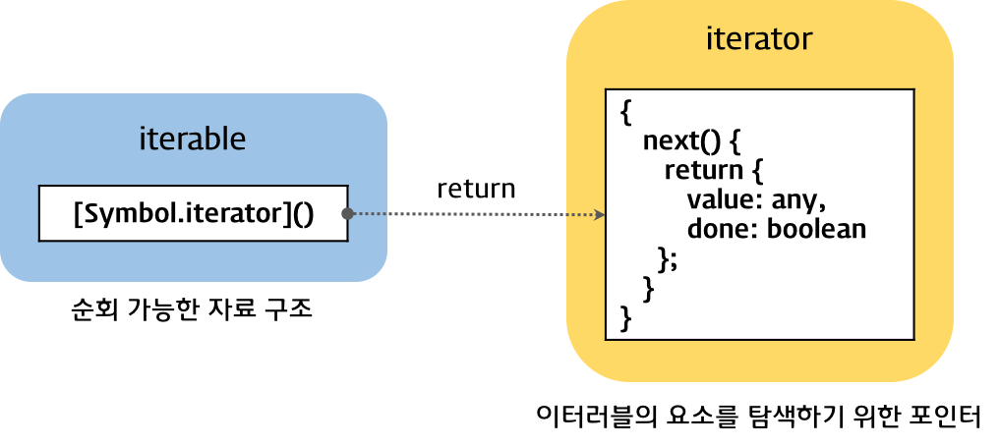
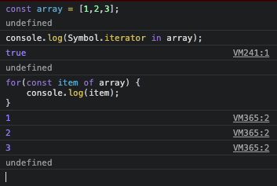
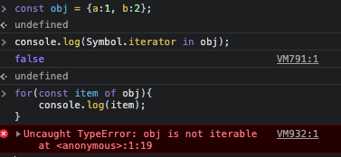
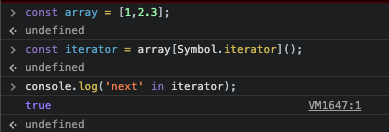
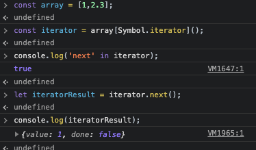
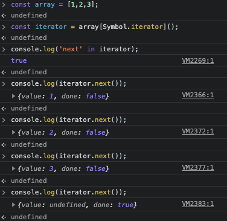

# 이터러블과 이터레이터

Iterable / Iterator / Generator

강의를 들어도 이해하기가 너무 어려웠기에 따로 정리하며 명확하게 이해하려고 한다.

### 참고 자료

[Iteration & for...of | PoiemaWeb](https://poiemaweb.com/es6-iteration-for-of)

## 1. 이터레이션 프로토콜

ES6에서 도입된 이터레이션 프로토콜(iteration protocol)은 데이터 컬렉션을 순회하기 위한 프로토콜(미리 약속된 규칙)이다. **이터레이션 프로토콜을 준수한 객체는 for..of문으로 순회할 수 있고 Spread 문법의 피연산자가 될 수 있다.**



*이터레이션 프로토콜(Iteration protocol)*

### 1.1 이터러블

이터러블 프로토콜을 준수한 **객체**를 이터러블이라 한다. 이터러블은 **Symbol.iterator 메서드**를 구현하거나 프로토타입 체인에 의해 상속한 객체를 말한다. Symbol.iterator 메서드는 이터레이터를 반환한다. 이터러블은 for..of 문에서 순회할 수 있으며 Spread 문법의 대상으로 사용할 수 있다.

배열은 Symbol.iterator 메서드를 소유한다. 따라서 배열은 이터러블 프로토콜을 준수한 이터러블이다.

```jsx
// 배열을 정의한다.
const array = [1,2,3];

// 배열은 Symbol.iterator 메서드를 소유한다.
// 따라서 배열은 이터러블 프로토콜을 준수한 이터러블이다.
console.log(Symbol.iterator in array); // true;

// 이터러블 프로토콜을 준수한 배열은 for..of  문에서 순회 가능하다.
for(const item of array) {
	console.log(item);
}
```



일반 객체는 Symbol.iterator 메서드를 소유하지 않는다. 따라서 일반 객체는 이터러블 프로토콜을 준수한 이터러블이 아니다.

```jsx
// 객체를 정의한다
const obj = { a: 1, b: 2 };

// 일반 객체는 Symbol.iterator 메서드를 소유하지 않는다.
// 따라서 일반 객체는 이터러블 프로토콜을 준수한 이터러블이 아니다.
console.log(Symbol.iterator in obj); // false

// 이터러블이 아닌 일반 객체는 for..of 문에서 순회할 수 없다.
// TypeError: obj is not iterable
for(const item of obj) {
	console.log(item);
}
```



일반 객체는 이터레이션 프로토콜을 준수(Symbol.iterator 메서드를 소유)하지 않기 때문에 이터러블이 아니다. 따라서 일반 객체는 for..of 문에서 순회할 수 없으며 Spread문법의 대상으로 사용할 수도 없다. 하지만 일반 객체도 이터러블 프로토콜을 준수하도록 구현하면 이터러블이 된다.

이는 ***3. 커스텀 이터러블*** 에서 살펴볼 것이다.

### 1.2 이터레이터

이터레이터 프로토콜은 next 메서드를 소유하고 있다. next 메서드를 호출하면 이터러블을 순회하며 {value, done} 프로퍼티를 갖는 이터레이터 리절트 객체를 반환한다. 이 규약을 준수한 객체가 이터레이터이다.

이터러블 프로토콜을 준수한 이터러블은 Symbol.iterator 메서드를 소유한다. 이 메서드를 호출하면 이터레이터를 반환한다. 이터레이터 프로토콜을 준수한 이터레이터는 next 매서드를 갖는다.

```jsx
// 배열은 이터러블 프로토콜을 준수한 이터러블이다.
const array = [1,2,3];

// Symbol.iterator 메서드는 이터레이터를 반환한다.
const iterator = array[Symbol.iterator]();

// 이터레이터 프로토콜을 준수한 이터레이터는 next 메서드를 갖는다.
console.log('next' in iterator); // true
```



이터레이터의 next 메서드를 호출하면 value, done 프로퍼티를 갖는 **이터레이터 리절트(iterator result) 객체를 반환한다.**

```jsx
// 배열은 이터러블 프로토콜을 준수한 이터러블이다.
const array = [1,2,3];

// Symbol.iterator 메서드는 이터레이터를 반환한다.
const iterator = array[Symbol.iterator]();

// 이터레이터 프로토콜을 준수한 이터레이터는 next 메서드를 갖는다.
console.log('next' in iterator); // true

// 이터레이터의 next 메서드를 호출하면 value, done 프로퍼티를 갖는 이터레이터 리절트 객체를 반환한다.
let iteratorResult = iterator.next();
console.log(iteratorResult); // { value: 1, done: false }
```



이터레이터의 next 메서드는 이터러블의 각 요소를 순회하기 위한 포인터의 역할을 한다. next 메서드를 호출하면 이터러블을 순차적으로 한 단계씩 순회하며 이터레이터 리절트 객체를 반환한다.

```jsx
// 배열은 이터러블 프로토콜을 준수한 이터러블이다.
const array = [1,2,3];

// Symbol.iterator 메서드는 이터레이터를 반환한다.
const iterator = array[Symbol.iterator]();

// 이터레이터 프로토콜을 준수한 이터레이터는 next 메서드를 갖는다.
console.log('next' in iterator); // true

// 이터레이터의 next 메서드를 호출하면 value, done 프로퍼티를 갖는 이터레이터 리절트 객체를 반환한다.
// next 메서드를 호출할 때마다 이터러블을 순회하며 이터레이터 리절트 객체를 반환한다.
console.log(iterator.next()); // { value: 1, done: false }
console.log(iterator.next()); // { value: 2, done: false }
console.log(iterator.next()); // { value: 3, done: false }
console.log(iterator.next()); // { value: undefined, done: true }
```



이터레이터의 next 메서드가 반환하는 이터레이터 리절트 객체의 value 프로퍼티는 현재 순회 중인 이터러블의 값을 반환하고 done 프로퍼티는 이터러블의 순회 완료 여부를 반환한다.

### 1.3 빌트인 이터러블

ES6에서 제공하는 빌트인 이터러블은 아래와 같다.

> Array, String, Map, Set, TypedArray(Int8Array, Uint8Array, Uint8ClampedArray, Int16Array, Uint16Array, Int32Array, Uint32Array, Float32Array, Float64Array), DOM data structure(NodeList, HTMLCollection), Arguments

```jsx
// 배열은 이터러블이다.
const array = [1,2,3];

// 이터러블은 Symbol.iterator 메서드를 소유한다.
// Symbol.iterator 메서드는 이터레이터를 반환한다.
let iter = array[Symbol.iterator]();

// 이터레이터는 next 메서드를 소유한다.
// next 메서드는 이터레이터 리절트 객체를 반환한다.
console.log(iter.next()); // {value: 1, done: false}
console.log(iter.next()); // {value: 2, done: false}
console.log(iter.next()); // {value: 3, done: false}
console.log(iter.next()); // {value: undefined, done: true}

// 이터러블은 for..of문으로 순회 가능하다.
for(const item of array) console.log(item);

// 문자열은 이터러블이다.
const string = 'hi';

// 이터러블은 Symbol.iterator 메서드를 소유한다.
// Symbol.iterator 메서드는 이터레이터륿 ㅏㄴ환한다.
iter = string[Symbol.iterator]();

// 이터레이터는 next 메서드를 소유한다.
// next 메서드는 이터레이터 리절트 객체를 반환한다.
console.log(iter.next()); // {value: 'h', done: false}
console.log(iter.next()); // {value: 'i', done: false}
console.log(iter.next()); // {value: undefined, done: true}

// 이터러블은 for..of 문으로 순회 가능하다.
foir(const letter of string) console.log(letter);

// arguments 객체는 이터러블이다.
(function(){
	// 이터러블은 Symbol.iterator 메서드를 소유한다.
	// Symbol.iterator 메서드는 이터레이터를 반환한다.
	iter = arguments[Symbol.iterator]();

	// 이터레이터는 next 메서드를 소유한다.
	// next 메서드는 이터레이터 리절트 객체를 반환한다.
	console.log(iter.next()); // {value: 1, done: false}
	console.log(iter.next()); // {value: 2, done: false}
	console.log(iter.next()); // {value: undefined, done: true}

	// 이터러블은 for..of 문으로 순회 가능하다.
	for(const arg of arguments) console.log(arg);
}(1,2));
```

## 2. for..of 문

for..of 문은 내부적으로 이터레이터의 next 메서드를 호출해 이터러블을 순회한다.

next 메서드가 반환한 이터레이터 리절트 객체의 **value 프로퍼티 값**을 for..of문의 **변수**에 할당한다.

그리고 이터레이터 리절트 객체의 done 프로퍼티 값이 false이면 이터러블의 순회를 계속하고 true이면 이터러블의 순회를 중단한다.

```jsx
// 배열
for(const item of ['a','b','c']) console.log(item);

// 문자열
for(const letter of 'abc') console.log(letter);

// Map
for(const [key, value] of new Map([['a', '1'], ['b','2'], ['c','3']]))
	console.log(`key: ${key} value: ${value}`);

// Set
for(const val of new Set([1,2,3])) console.log(val);
```

for..of 문이 내부적으로 동작하는 것을 for문으로 표현하면 아래와 같다.

```jsx
// 이터러블
const iterable = [1,2,3];

// 이터레이터
const iterator = iterable[Symbol.iterator]();

for(;;) {
	// 이터레이터의 next 메서드를 호출하여 이터러블을 순회한다.
	const res = iterator.next();
	
	// next 메서드가 반환하는 이터레이터 리절트 객체의 done 프로퍼티가 true가 될 때까지 반복한다.
	if(res.done) break;

	console.log(res);
}
```

## 3. 커스텀 이터러블

### 3.1 커스텀 이터러블 구현

일반 객체는 이터러블이 아니다. 일반 객체는 Symbol.iterator메서드를 소유하지 않는다.

즉, 일반 객체는 이터러블 프로토콜을 준수하지 않으므로 for..of문으로 순회할 수 없다.

```jsx
// 일반 객체는 이터러블이 아니다.
const obj = {a: 1, b: 2};

// 일반 객체는 Symbol.iteraotr 메서드를 소유하지 않는다.
// 따라서 일반 객체는 이터러블 프로토콜을 준수한 이터러블이 아니다.
console.log(Symbol.iterator in obj); // false

// 이터러블이 아닌 일반 객체는 for..of 문에서 순회할 수 없다.
// TypeError: obj is not iterable
for (const p of obj) {
  console.log(p);
}
```

하지만 일반 객체가 이터레이션 프로토콜을 준수하도록 구현하면 이터러블이 된다.

피보나치 수열(1,2,3,5.....)을 구현한 간단한 이터러블을 만들어보자.

```jsx
const fibonacci = {
	// Sumbol.iterator 메서드를 구현하여 이터러블 프로토콜을 준수
	[Symbol.iterator]() {
		let [pre, cur] = [0,1];
		// 최대값
		const max = 10;

		// Symbol.iterator 메서드는 next 메서드를 소유한 이터레이터를 반환해야 한다.
		// next 메서드는 이터레이터 리절트 객체를 반환
		return {
			// fibonacci 객체를 순회할 떄마다 next 메서드가 호출된다.
			next() {
				[pre, cur] = [cur, pre+cur];
				return {
					value: cur,
					done: cur >= max
				}
			}
		}
	}
};

// 이터러블의 최대값을 외부에서 전달할 수 없다.
for(const num of fibonacci) {
	// for..of 내부에서 break는 가능하다.
	// if(num >= 10) break;
	console.log(num); // 1 2 3 5 8
}
```

Symbol.iteraotr 메서드는 next 메서드를 갖는 이터레이터를 반환하여야 한다. 그리고 next 메서드는 done과 value 프로퍼티를 가지는 이터레이터 리절트 객체를 반환한다. for..of문은 done 프로퍼티가 true가 될 때까지 반복하며 done 프로퍼티가 true가 되면 반복을 중지한다.

이터러블은 for..of 문만이 아니라 spread 문법 디스트럭처링 할당, Map과 Set의 생성자에도 사용된다.

```jsx
// spread 문법과 디스트럭처링을 사용하면 이터러블을 손쉽게 배열로 변환할 수 있다.
// spread 문법
const arr = [...fibonacci];
console.log(arr); // [1,2,3,5,8]

// 디스트럭처링
const [first, second, ...rest] = fibonacci;
console.log(first, second, rest); // 1 2 [3,5,8]
```

### 3.2 이터러블을 생성하는 함수

위 fibonacci 이터러블에는 외부에서 값을 전달할 방법이 없다는 아쉬운 점이 있다. ifbonacci 이터러블의 최대값을 외부에서 전달할 수 있도록 수정해 보자. 이터러블의 최대 순회수를 전달받아 이터러블을 반환하는 함수를 만들면 된다.

```jsx
// 이터러블을 반환하는 함수
const fibonacciFunc = function(max){
	let [pre, cur] = [0,1];

	return {
		// Symbol.iterator 메서드를 구현하여 이터러블 프로토콜을 준수
		[Symbol.iterator](){
			// Symbol.iterator 메서드는 next 메서드를 소유한 이터레이터를 반환해야 한다.	
			// next 메서드는 이터레이터 리절트 객체를 반환
			return {
				// fibonacci 객체를 순회할 떄마다 next 메서드가 호출된다.
				next() {
					[pre,cur] = [cur, pre + cur];
					return {
						value: cur,
						done: cur >= max
					};
				}
			};
		}
	};
};

// 이터러블을 반환하는 함수에 이터러블의 최대값을 전달한다.
for(const num of fibonacciFunc(10)){
	console.log(num); // 1 2 3 5 8
}
```

### 3.3 이터러블이면서 이터레이터인 객체를 생성하는 함수

이터레이터를 생성하려면 이터러블의 Symbol.iterator 메서드를 호출해야 한다.

이터러블이면서 이터레이터인 객체를 생성하면 Symbol.iterator 메서드를 호출하지 않아도 된다.

```jsx
// 이터러블이면서 이터레이터인 객체를 반환하는 함수
const fibonacciFunc = function (max) {
  let [pre, cur] = [0, 1];

  // Symbol.iterator 메소드와 next 메소드를 소유한
  // 이터러블이면서 이터레이터인 객체를 반환
  return {
    // Symbol.iterator 메소드
    [Symbol.iterator]() {
      return this;
    },
    // next 메소드는 이터레이터 리절트 객체를 반환
    next() {
      [pre, cur] = [cur, pre + cur];
      return {
        value: cur,
        done: cur >= max
      };
    }
  };
};

// iter는 이터러블이면서 이터레이터이다.
let iter = fibonacciFunc(10);

// iter는 이터레이터이다.
console.log(iter.next()); // {value: 1, done: false}
console.log(iter.next()); // {value: 2, done: false}
console.log(iter.next()); // {value: 3, done: false}
console.log(iter.next()); // {value: 5, done: false}
console.log(iter.next()); // {value: 8, done: false}
console.log(iter.next()); // {value: 13, done: true}

iter = fibonacciFunc(10);

// iter는 이터러블이다.
for (const num of iter) {
  console.log(num); // 1 2 3 5 8
}
```

아래의 객체는 Symbol.iterator 메서드와 next 메서드를 소유한 이터러블이면서 이터레이터이다. Symbol.iterator 메서드는 this를 반환하므로 next 메서드를 갖는 이터레이터를 반환한다.

```jsx
{
  [Symbol.iterator]() {
    return this;
  },
  next() { /***/ }
}
```

### 3.4 무한 이터러블과 Lazy evaluation(지연 평가)

무한 이터러블(infinite sequence)을 생성하는 함수를 정의해보자. 이를 통해 무한 수열을 표현할 수 있다.

```jsx
// 무한 이터러블을 생성하는 함수
const fibonacciFunc = function () {
  let [pre, cur] = [0, 1];

  return {
    [Symbol.iterator]() {
      return this;
    },
    next() {
      [pre, cur] = [cur, pre + cur];
      // done 프로퍼티를 생략한다.
      return { value: cur };
    }
  };
};

// fibonacciFunc 함수는 무한 이터러블을 생성한다.
for (const num of fibonacciFunc()) {
  if (num > 10000) break;
  console.log(num); // 1 2 3 5 8...
}

// 무한 이터러블에서 3개만을 취득한다.
const [f1, f2, f3] = fibonacciFunc();
console.log(f1, f2, f3); // 1 2 3
```

## 4 이터레이션 프로토콜의 필요성

데이터 소비자(Data Consumer)인 for..of문, spread 문법 등은 아래와 같이 다양한 데이터 소스를 사용한다.

> Array, String, Map, Set, TypedArray(Int8Array, Uint8Array, Uint8ClampedArray, Int16Array, Uint16Array, Int32Array, Uint32Array, Float32Array, Float64Array), DOM data structure(NodeList, HTMLCollection), Arguments

위 데이터 소스는 모두 이터레이션 프로토콜을 준수하는 이터러블이다. 즉, 이터러블은 데이터 공급자(Data provider)의 역할을 한다.

만약 이처럼 다양한 데이터 소스가 각자의 순회 방식을 갖는다면 데이터 소비자는 다양한 데이터 소스의 순회 방식을 모두 지원해야 한다. 이는 효율적이지 않다. 하지만 다양한 데이터 소스가 이터레이션 프로토콜을 준수하도록 규정하면 데이터 소비자는 이터레이션 프로토콜만을 지원하도록 구현하면 된다.

즉, 이터레이션 프로토콜은 다양한 데이터 소스가 하나의 순회 방식을 갖도록 규정하여 데이터 소비자가 효율적으로 다양한 데이터 소스를 사용할 수 있도록 **데이터 소비자와 데이터 소스를 연결하는 인터페이스의 역할을 한다.**


이터러블 데이터 소비자와 데이터 소스를 연결하는 인터페이스

이터러블을 지원하는 데이터 소비자는 내부에서 Symbol.iterator 메서드를 호출해 이터레이터를 생성하고 이터레이터의 next 메서드를 호출하여 이터러블을 순회한다. 그리고 next 메서드가 반환한 이터레이터 리절트 객체의 value 프로퍼티 값을 취득한다.

---

"이터레이션 프로토콜의 중요성"에서 살펴보았듯이 이터러블은 데이터 공급자(Data provider)의 역할을 한다. 배열, 문자열, Map, Set 등의 빌트인 이터러블은 데이터를 모두 메모리에 확보한 다음 동작한다. 하지만 이터러블은 **지연 평가**Lazy evaluation를 통해 값을 생성한다. Lazy evaluation은 평가 결과가 필요할 때까지 평가를 늦추는 기법이다. 위 예제를 통해 Lazy evaluation에 대해 좀 더 자세히 살펴보자.

위 예제의 fibonacciFunc 함수는 무한 이터러블을 생성한다. 하지만 fibonacciFunc 함수가 생성한 무한 이터러블은 데이터를 공급하는 메커니즘을 구현한 것으로 데이터 소비자인 for…of 문이나 디스트럭처링 할당이 실행되기 이전까지 데이터를 생성하지는 않는다. for…of 문의 경우, 이터러블을 순회할 때 내부에서 이터레이터의 next 메소드를 호출하는데 바로 이때 데이터가 생성된다. next 메소드가 호출되기 이전까지는 데이터를 생성하지 않는다. 즉, 데이터가 필요할 때까지 데이터의 생성을 지연하다가 데이터가 필요한 순간 데이터를 생성한다.