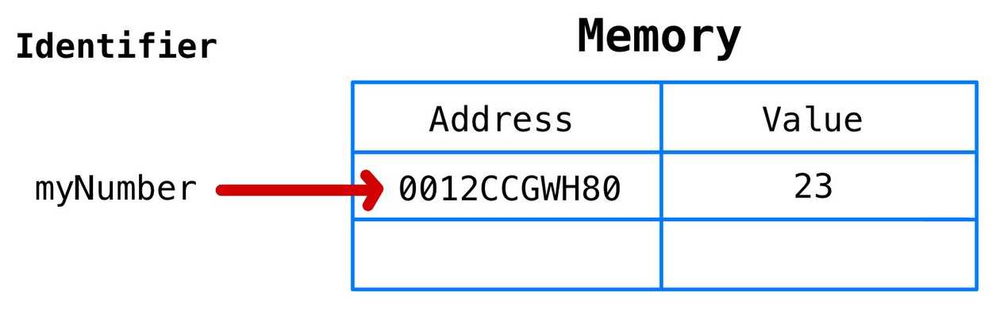

# JavaScript의 메모리 모델

---

이 글은 Ethan Nam의 *JavaScript's Memory Model*을 번역한 글을 가져온 것입니다.

번역글 URL : [https://junwoo45.github.io/2019-11-04-memory_model/](https://junwoo45.github.io/2019-11-04-memory_model/)

```jsx
// 변수를 선언하고 초기화
var a = 5;
let b = 'xy';
const c = true;

// 새로운 값을 할당합니다.
a = 6;
b = b + 'z';
c = false // TypeError: Assignment to constant variable
```

변수를 선언하고, 초기화하고, 새로운 값을 할당하는 것은 개발자들의 일상적인 업무입니다.

그런데 이렇게 했을 때 **실제로** 어떤 일이 발생할까요?

자바스크립트는 이러한 기본적인 기능을 내부적으로 어떻게 처리할까요?

그리고 더 중요한 건, 자바스크립트 개발자가 이러한 세세한 내용까지 이해하는게 도움이 될까요?

본문은 이러한 내용을 다루려고 합니다.

1. JavaScript 원시 타입의 변수 선언과 할당
2. JavaScript의 메모리 모델 : 콜스택과 힙
3. JavaScript 참고 타입의 변수 선언과 할당
4. let, const

### 참고

- 원시타입(Primitive type) : Number, String, Boolean, Null, Undefined
    - 원본이 바뀌어도 복사본은 변하지 않는다.
- 참조타입(Reference type) : Function, Array, Object
    - 원본이 바뀌면 복사본도 똑같이 따라 바뀐다.

---

## JavaScript 원시 타입의 변수 선언과 할당

아래 코드는 `myNumber`라는 변수를 선언하고 23이라는 값(value)으로 초기합니다.

```jsx
let myNumber = 23
```

위 코드가 실행될 때, JavaScript는 아래와 같이 행동합니다.

1. 변수의 고유 식별자("myNumber")를 생성합니다.
2. 메모리에 주소를 할당합니다. (런타임에 할당될 것입니다.)
3. 생성된 주소에 값(value)을 저장합니다(23).



보통 우리가 생각하는 표현 : "myNumber는 23과 같다."

정확한 표현 : "myNumber는 23이라는 값(value)을 보유한 메모리 주소와 같다."

이 두 차이를 아는 것은 매우 중요합니다.

만약 우리가 `newVar`라는 새 변수를 만들고 `myNumber`를 할당한다면

```jsx
let newVar = myNumber;
```

`myNumber`는 "0012CCGWH80"라는 메모리 주소와 같으므로, `newVar`도 23을 값(value)으로 가지고 있는 메모리 주소 "0012CCGWH80"와 같게 됩니다.

표현 : "newVar는 이제 23과 같습니다."


이제 다음과 같이 입력하게 된다면 어떻게 될까?

```jsx
myNumber = myNumber + 1
```

`myNumber`는 너무나 당연하게 24라는 값을 가지게 됩니다.

그러면 `newVar`도 같은 메모리 주소를 가지고 있다고 했는데, newVar=24가 되는 걸까요?

당연히 아닙니다.

`myNumber + 1` 의 연산 결과가 `24`로 확인되면, JavaScript는 메모리에 새로운 주소를 할당합니다.

메모리의 값으로 `24`를 저장한 뒤, `myNumber`는 이 메모리 주소를 가리키게 됩니다.

JavaScript의 원시 타입 데이터는 변경불가능(immutable)하기 때문에 이런 방식으로 동작합니다.


Other example

```jsx
let myString = "abc";
myString = myString + "d";
```

- JavaScript의 문자열은 원시 타입이기 때문에, `abc`가 `d`와 연결될 때 새로운 메모리 주소가 할당됩니다.
- 문자열 `abcd`는 그 메모리 주소에 저장되고, `myString`이라는 변수는 그 새로운 메모리 주소를 가리킵니다.


이제 이러한 원시타입 메모리 할당이 어디서 발생하는지 알아볼 차례입니다.

---

## JavaScript의 메모리 모델 : 콜스택과 힙

JavaScript의 메모리 모델은 **콜스택**과 **힙**이라는 명확히 구분된 두 가지 영역으로만 이루어져있다고 **가정**합니다.


콜스택은 원시 타입이 저장되는 공간입니다. (함수 호출도 이 곳에 저장이 됩니다.)

지금까지 변수를 선언했을 때의 상황들을 대략적인 그림으로 표현해보자면 다음과 같습니다.


각 변수의 값을 보여주기 위해 메모리 주소를 생략했습니다.

그러나, 변수는 값을 가지고 있는 메모리 주소를 가리키고 있다는 사실은 잊으면 안됩니다.

이 사실이 let과 const에 대한 이해의 핵심이 되는 내용입니다.

이번에는 힙입니다.

힙은 원시타입이 아닌 타입들이 저장되는 공간입니다.

***힙은 갑자기 데이터가 커질 수도 있는, 배열과 객체와 같은 정렬되지 않은 데이터들을 저장할 수 있다는 점이 핵심포인트입니다.***

---

## JavaScript 참조타입의 변수 선언과 할당

참조타입은 원시타입과는 다르게 동작합니다.

```jsx
let myArray = [];
```

`myArray`변수를 선언하고 "[]"과 같은 참조타입을 할당 했을 때, 다음과 같은 일이 메모리에서 일어나게 됩니다.

1. 변수의 고유 식별자를 생성합니다. ("myArray");
2. 콜스택의 메모리에 주소를 할당합니다.(런타임에 할당될 것입니다.)
3. 힙에 할당된 메모리 주소를 콜스택의 값(value)으로 저장합니다.(런타임에 할당될 것입니다.)
4. 힙의 메모리 주소에 할당된 값(빈 배열[])을 저장합니다.


여기에서 `push`나 `pop`같은 메서드를 수행할 수 있습니다.

```jsx
myArray.push('first');
myArray.push('second');
myArray.push('third');
myArray.push('fourth');
myArray.pop();
```


---

## let, const

일반적으론, 가능한 한 const를 사용해야하며 변수가 변경될거란 사실을 알 때만 let을 사용해야합니다.

이 `변경`이라는게 무슨 의미인지 명확히 짚고 넘어가겠습니다.

`변경`이란 `값(value)의 변경`이 아닙니다.

그렇게 오해한다면 아래와 같은 실수를 하게 됩니다.

```jsx
let sum = 0
sum = 1 + 2 + 3 + 4 + 5

let numbers = []
numbers.push(1)
numbers.push(2)
numbers.push(3)
numbers.push(4)
numbers.push(5)
```

`push` 매서드를 사용하여 배열에 무언가를 넣는 행위를 `값이 변경`됨으로 해석하여 let을 사용하여 변수를 선언하였습니다.

이것은 틀렸습니다. `let numbers`가 아닌 `const numbers`로 선언했어야 합니다.

이제 정확한 의미를 알아보겠습니다.

`**변경`이란. 메모리 주소의 변경을 의미합니다.**

`let`은 메모리 주소의 변경을 허락합니다.

`const`는 메모리 주소의 변경을 허락하지 않습니다.

```jsx
const importantID = 489;
importantID = 100; // TypeError: Assignment to constant variable
```

위 코드를 설명해보겠습니다.

`importantID`가 선언되면, 메모리 주소가 할당되고, 489라는 값(value)이 저장됩니다.

변수 `importantID`는 메모리 주소와 같다는 점을 잊으면 안됩니다.


100이라는 값이 `importantID`에 할당되면, 100은 원시타입이기 때문에 새로운 메모리 주소가 할당되고, 100이라는 값(value)이 그 메모리 주소에 저장됩니다.

그리고 자바스크립트는 그 새로운 메모리 주소를 `importantID`에 할당하려고 시도하며 이 부분에서 에러가 발생합니다.

`const`를  사용해서 변수를 선언했다는 의미는 `importantID`의 ID가 변하는 것을 원하지 않았다는 뜻이기에, 의 상황은 우리가 원하는 대로 동작하고 있다고 볼 수 있습니다.


이 개념은 처음에는 혼란스러울 수 있습니다. 직관적이지 않기 때문입니다.

'배열은 변경할 수 있는 경우에만 유용한데, const는 이를 허용하지 않으니... 그렇다면 왜 const를 사용해야 하는거지?'라고 생각할 수 있습니다.

그러나, `변경`은 메모리 주소에 의해 정의된다는 것을 다시 한 번 기억해야합니다.

배열을 `const`로 선언하는 것이 왜 괜찮고, 왜 선호되는지 더욱 자세히 알아봅시다.

```jsx
const myArray = [];
```

`myArray`가 선언되면 메모리 주소가 콜스택에 할당되고, 그 메모리 주소의 값(value)은 힙에 할당된 메모리 주소입니다. 힙이 저장된 값은 실제 빈 배열입니다.


만약 이렇게 한다면

```jsx
myArray.push(1);
myArray.push(2);
myArray.push(3);
myArray.push(4);
myArray.push(5);
```


push 메서드는 힙에 존재하는 배열에 숫자를 밀어 넣습니다.

**그러나, 변수 myArray의 메모리 주소는 변경되지 않습니다.**

이것이 `myArray`가 `const`로 선언되었지만 에러가 발생하지 않는 이유입니다.

`myArray`는 여전히 "0458AFCZX91"라는 메모리 주소와 같으며, "0458AFCZX91"는 힙의 배열을 값(value)으로 가지는 "22VVCX011"를 값(value)으로 가지고 있습니다.

다음과 같이 실행하면 에러가 발생합니다.

```jsx
myArray = 3;
```

숫자 3은 원시 타입이기 때문에 콜스택의 메모리 주소가 할당되고, 3이라는 값이 저장되며, 그리고 나서 이렇게 생긴 새로운 메모리 주소를 `myArray`에 할당하려고 합니다.

그러나 `myArray`는 `const`로 선언되었기 때문에 이러한 과정은 허용되지 않습니다.


Other example : 

```jsx
myArray = ["a"];
```

['a']는 참조타입인 배열이므로 콜스택에 새로운 메모리 주소가 할당되고, 콜스택 메모리 주소의 값(value)으로 힙 메모리 주소가 저장되며, 힙 메모리 주소의 값(value)은 ['a']입니다.

그런 다음 콜스택 메모리 주소를 `myArray`에 할당하려 하면 오류가 발생합니다.


`const`로 선언된 객체의 경우에도 배열과 마찬가지로 찬조 타입이므로, key 값을 추가하고 프로퍼티를 업데이트하는 등의 작업을 수행할 수 있습니다.

```jsx
const myObj = {};
myObj["newKey"] = "someValue" // this will not throw an error.
```